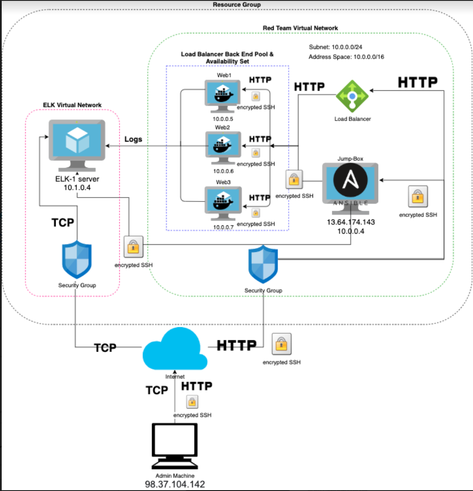
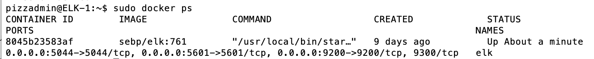

## Automated ELK Stack Deployment

The files in this repository were used to configure the network depicted below.

These files have been tested and used to generate a live ELK deployment on Azure. They can be used to either recreate the entire deployment pictured above. Alternatively, select portions of the cloud-setup.yml file may be used to install only certain pieces of it, such as Filebeat.  
  All in one:
  - [cloud-setup.yml](https://github.com/keawhite/CyberBootcamp/blob/main/ELK_project/Ansible/cloud-setup.yml)  
Separate portions:
  - [elk-setup.yml](https://github.com/keawhite/CyberBootcamp/blob/main/ELK_project/Ansible/elk-setup.yml)
  - [web-setup.yml](https://github.com/keawhite/CyberBootcamp/blob/main/ELK_project/Ansible/web-setup.yml)
  - [filebeat-playbook.yml](https://github.com/keawhite/CyberBootcamp/blob/main/ELK_project/Ansible/filebeat-playbook.yml)
  - [metricbeat-playbook.yml](https://github.com/keawhite/CyberBootcamp/blob/main/ELK_project/Ansible/metricbeat-playbook.yml)

This document contains the following details:
- Description of the Topology
- Access Policies
- ELK Configuration
  - Beats in Use
  - Machines Being Monitored
- How to Use the Ansible Build

### Description of the Topology

The main purpose of this network is to expose a load-balanced and monitored instance of DVWA, the D*mn Vulnerable Web Application.

Load balancing ensures that the application will be highly available, in addition to restricting access to the network.

Integrating an ELK server allows users to easily monitor the vulnerable VMs for changes to the system and system files.

The configuration details of each machine may be found below.

| Name                | Function    | IP Address | Operating System |
|---------------------|-------------|------------|------------------|
| Jump-Box-Provisoner | Gateway     | 10.0.0.4   | Linux            |
| Web-1               | DVWA server | 10.0.0.5   | Linux            |
| Web-2               | DVWA server | 10.0.0.6   | Linux            |
| Web-3               | DVWA server | 10.0.0.7   | Linux            |
| ELK-1               | ELK server  | 10.1.0.4   | Linux            |

### Access Policies

The machines on the internal network are not exposed to the public Internet. 

Only the Jump-Box-Provisioner machine can accept connections from the Internet. Access to this machine is only allowed from the following IP addresses:
- 98.37.104.142

Machines within the network can only be accessed by SSH from the Jump-Box-Provisioner machine.
- IP address: 10.0.0.4

A summary of the access policies in place can be found in the table below.

| Name                 | Publicly Accessible | Allowed IP Addresses |
|----------------------|---------------------|----------------------|
| Jump-Box-Provisioner | Yes                 | 98.37.104.142        |
| Web-1                | No                  | 10.0.0.4             |
| Web-2                | No                  | 10.0.0.4             |
| Web-3                | No                  | 10.0.0.4             |
| ELK-1                | No                  | 10.0.0.4             |

### Elk Configuration

Ansible was used to automate configuration of the ELK machine. No configuration was performed manually, which is advantageous because now horizontal scaling can be done much more efficiently.  Any number a new machines can be configured with the same settings in minutes.

The playbook implements the following tasks:
- increase virtual memory & use it
- install docker.io and python3-pip packages
- install docker
- download and launch the ELK container

The following screenshot displays the result of running `docker ps` after successfully configuring the ELK instance.

### Target Machines & Beats
This ELK server is configured to monitor the following machines:
- Web-1:10.0.0.5
- Web-2:10.0.0.6
- Web-3:10.0.0.7

We have installed the following Beats on these machines:
- Filebeat
- Metricbeat

These Beats allow us to collect the following information from each machine:
Filebeat collects data about specific files (e.g. changes to Apache log files) on remote machines.
Metricbeat records various system and service metrics (e.g. CPU usage) for remote machines.

### Using the Playbook
In order to use the playbook, you will need to have an Ansible control node already configured. Assuming you have such a control node provisioned: 

SSH into the control node and follow the steps below:
- Copy the cloud-setup.yml file to /etc/ansible/.
- Update the hosts file to include a webservers group and an ELK group
- Run the playbook, and navigate to http://<ELK server public IP>/app/kibana to check that the installation worked as expected.

#Download the playbook  
`curl https://raw.githubusercontent.com/keawhite/CyberBootcamp/main/ELK_project/Ansible/cloud-setup.yml?token=AQWV3VNQ4YEROIHT3FS4QVS723DD6`  
#Move the playbook to ansible directory  
`mv <working directory>/cloud-setup.yml /etc/ansible`  
#Update the hosts file and playbook for specific needs  
`nano hosts`  
`nano cloud-setup.yml`  
#Run the play  
`ansible-playbook cloud-setup.yml`  
